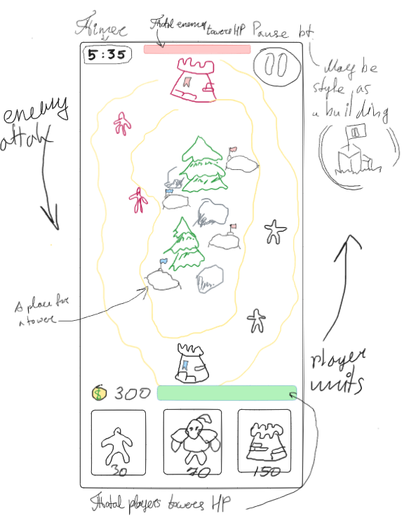
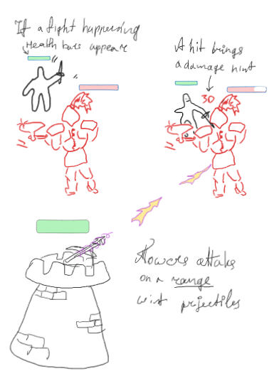
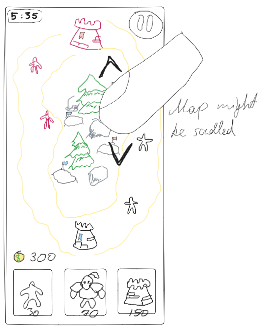
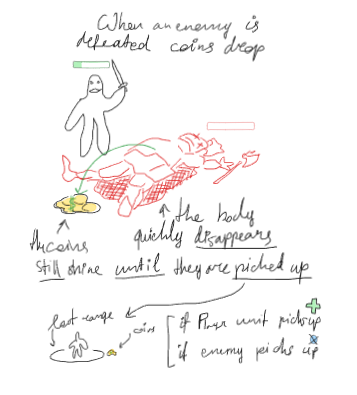
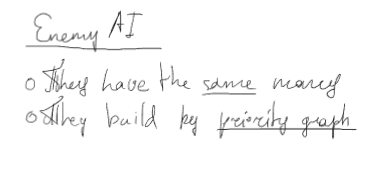
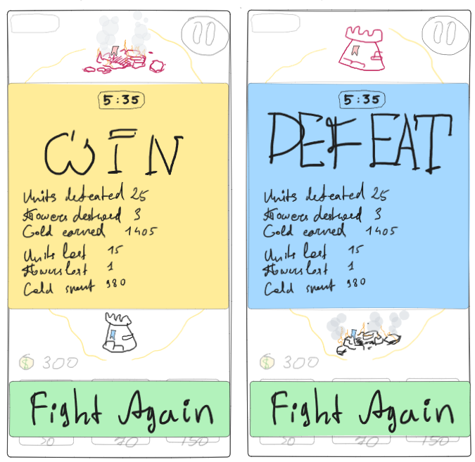
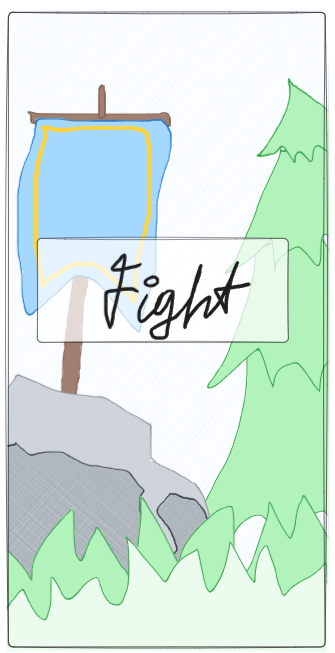

# td_project
Tower defence like game

## References

Sneak look at Warcraft Rumble Screenshots

## The Sketch

_Pic 0. Main Field_

_Pic 1. Combat_

_Pic 2. Field Scroll_

_Pic 3. Drop & Loot_

_Pic 4. AI Camp_

_Pic 5. Win / Defeat_

_Pic 6. Start the Game_

## 3rd party assets

| Name | Description | Source | License |
|---|---|---|---|
| RPG Tiny Hero Duo PBR Polyart | 3d characters | [Unity Asset Store](https://assetstore.unity.com/packages/3d/characters/humanoids/rpg-tiny-hero-duo-pbr-polyart-225148) | License agreement Standard Unity Asset Store EULA |
| - | - | [-](-) | License agreement Standard Unity Asset Store EULA |
